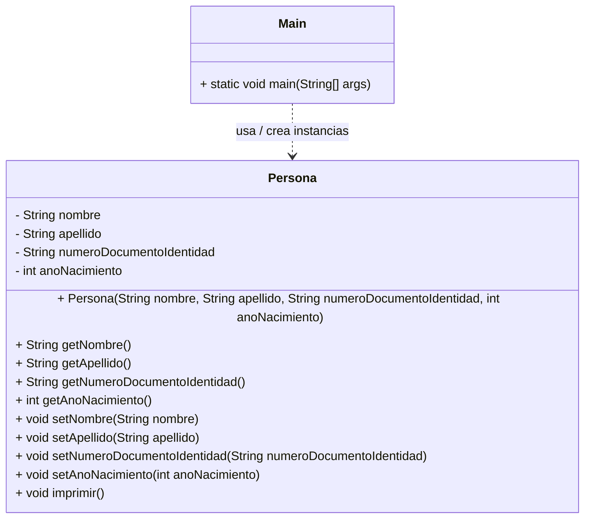

# Diagrama de Clases

El siguiente diagrama muestra las clases principales del proyecto y sus relaciones.

```mermaid
classDiagram
    class Persona {
        - String nombre
        - String apellido
        - String numeroDocumentoIdentidad
        - int anoNacimiento
        + Persona(String nombre, String apellido, String numeroDocumentoIdentidad, int anoNacimiento)
        + String getNombre()
        + String getApellido()
        + String getNumeroDocumentoIdentidad()
        + int getAnoNacimiento()
        + void setNombre(String nombre)
        + void setApellido(String apellido)
        + void setNumeroDocumentoIdentidad(String numeroDocumentoIdentidad)
        + void setAnoNacimiento(int anoNacimiento)
        + void imprimir()
    }

    class Main {
        + static void main(String[] args)
    }

    Main ..> Persona : usa / crea instancias
```

- Paquete: `com.example`
- `Main` crea y usa instancias de `Persona`.
