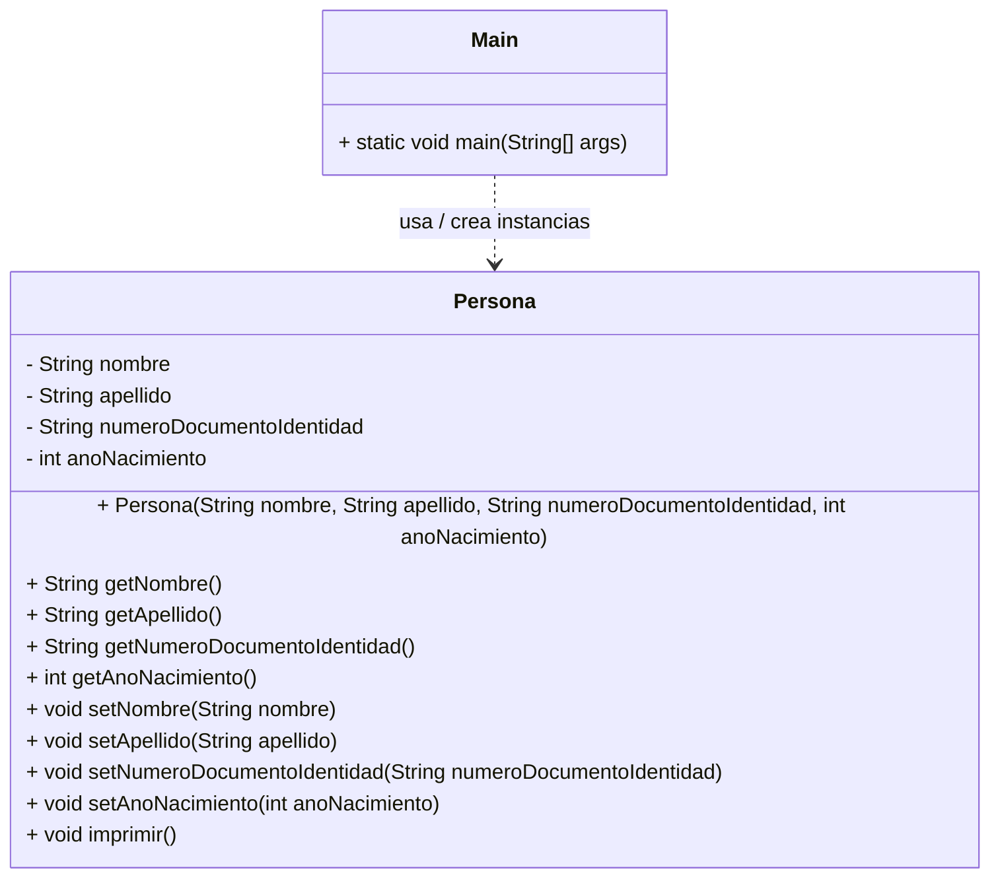

# Persona - Ejemplo Java


# Diagrama de Clases

El siguiente diagrama muestra las clases principales del proyecto y sus relaciones.



- Paquete: `com.example`
- `Main` crea y usa instancias de `Persona`.

---
# persona


Proyecto de ejemplo en Java que muestra el uso de una clase `Persona` con getters, setters y un método `imprimir()`.

Estructura principal
- `src/main/java/com/example/Main.java`: Clase `Main` que crea instancias de `Persona` y demuestra su uso.
- `src/main/java/com/example/Persona.java`: Clase `Persona` con atributos, constructores, getters, setters y `imprimir()`.

Requisitos
- Java 17 (o superior)
- Maven 3.x

Compilar desde la línea de comandos

1. Abrir terminal en la carpeta del proyecto (donde está `pom.xml`).

```bash
mvn clean compile
```

Ejecutar la clase principal (después de compilar)

```bash
# Ejecutar directamente desde clases compiladas
java -cp target/classes com.example.Main

# O usando Maven (si tiene el plugin exec configurado)
# mvn exec:java -Dexec.mainClass=com.example.Main
```

Salida esperada

El programa imprime los datos de las dos personas, luego muestra los nombres usando getters. Algo similar a:

```
Nombre: Daniel Bonilla
Apellido: Perez
Documento: 1053121010
Año Nacimiento: 1998
-
Nombre: Luis
Apellido: Leon
Documento: 1053223344
Año Nacimiento: 2001
-
Accediendo getters:
Daniel Bonilla
Luis
```

Notas y solución a errores visuales en IDE
- Si VS Code muestra errores pero `mvn compile` pasa, intente recargar el Workspace Java: `Java: Clear Java Language Server Workspace` o reinicie VS Code.
- Asegúrese de que el archivo `Persona.java` y `Main.java` estén en el paquete `com.example` y en las rutas correctas.

Contacto
- Creado como ejemplo didáctico para practicar clases, getters/setters y Maven.